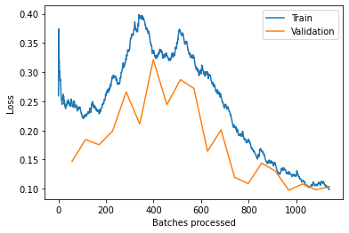
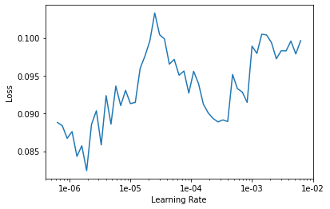
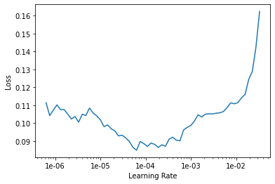

# Identifiing Lego bricks

In this Notebook I will use what I have learned from the [fastai course](https://course.fast.ai/) part one to three. I found this nice lego brick dataset on Kaggle. Thanks to [Francesco Garcia](https://www.kaggle.com/pacogarciam3/lego-brick-sorting-image-recognition), who made a lot  of pictures of different bricks. 
I show how I trained a CNN on resnet34 and resnet50.

### Imports


```python
%reload_ext autoreload
%autoreload 2
%matplotlib inline
%config Completer.use_jedi = False
```


```python
from fastai.vision import *
from fastai.metrics import error_rate
import shutil
from zipfile import ZipFile
from IPython.display import display, Image
```

### Data Import from Kaggle


```python
! {sys.executable} -m pip install kaggle --upgrade
```

    Collecting kaggle
    [?25l  Downloading https://files.pythonhosted.org/packages/62/ab/bb20f9b9e24f9a6250f95a432f8d9a7d745f8d24039d7a5a6eaadb7783ba/kaggle-1.5.6.tar.gz (58kB)
         |████████████████████████████████| 61kB 3.5MB/s eta 0:00:011
    [?25hRequirement already satisfied, skipping upgrade: urllib3<1.25,>=1.21.1 in /opt/conda/lib/python3.7/site-packages (from kaggle) (1.24.2)
    Requirement already satisfied, skipping upgrade: six>=1.10 in /opt/conda/lib/python3.7/site-packages (from kaggle) (1.12.0)
    Requirement already satisfied, skipping upgrade: certifi in /opt/conda/lib/python3.7/site-packages (from kaggle) (2019.11.28)
    Requirement already satisfied, skipping upgrade: python-dateutil in /opt/conda/lib/python3.7/site-packages (from kaggle) (2.8.1)
    Requirement already satisfied, skipping upgrade: requests in /opt/conda/lib/python3.7/site-packages (from kaggle) (2.22.0)
    Requirement already satisfied, skipping upgrade: tqdm in /opt/conda/lib/python3.7/site-packages (from kaggle) (4.43.0)
    Collecting python-slugify
      Downloading https://files.pythonhosted.org/packages/92/5f/7b84a0bba8a0fdd50c046f8b57dcf179dc16237ad33446079b7c484de04c/python-slugify-4.0.0.tar.gz
    Requirement already satisfied, skipping upgrade: idna<2.9,>=2.5 in /opt/conda/lib/python3.7/site-packages (from requests->kaggle) (2.8)
    Requirement already satisfied, skipping upgrade: chardet<3.1.0,>=3.0.2 in /opt/conda/lib/python3.7/site-packages (from requests->kaggle) (3.0.4)
    Collecting text-unidecode>=1.3
    [?25l  Downloading https://files.pythonhosted.org/packages/a6/a5/c0b6468d3824fe3fde30dbb5e1f687b291608f9473681bbf7dabbf5a87d7/text_unidecode-1.3-py2.py3-none-any.whl (78kB)
         |████████████████████████████████| 81kB 5.9MB/s  eta 0:00:01
    [?25hBuilding wheels for collected packages: kaggle, python-slugify
      Building wheel for kaggle (setup.py) ... [?25ldone
    [?25h  Created wheel for kaggle: filename=kaggle-1.5.6-cp37-none-any.whl size=72859 sha256=8c639412a2863d4ca750a063310b004eb235f4f6967c717c54e6d2779dabbd25
      Stored in directory: /root/.cache/pip/wheels/57/4e/e8/bb28d035162fb8f17f8ca5d42c3230e284c6aa565b42b72674
      Building wheel for python-slugify (setup.py) ... [?25ldone
    [?25h  Created wheel for python-slugify: filename=python_slugify-4.0.0-py2.py3-none-any.whl size=5487 sha256=cb6a3f072a028e27823d12e95dfb150948c8586cfdd6df4eba26dee47dc4f7e6
      Stored in directory: /root/.cache/pip/wheels/11/94/81/312969455540cb0e6a773e5d68a73c14128bfdfd4a7969bb4f
    Successfully built kaggle python-slugify
    Installing collected packages: text-unidecode, python-slugify, kaggle
    Successfully installed kaggle-1.5.6 python-slugify-4.0.0 text-unidecode-1.3
    


```python
path = Config.data_path()/'/workspace/course-v3/nbs/dl1/lego/'
path.mkdir(parents=True, exist_ok=True)
path
```


    PosixPath('/workspace/course-v3/nbs/dl1/lego')


```python
cd /root/
```

    /root
    


```python
mkdir .kaggle
```


```python
cd /workspace/course-v3/nbs/dl1/lego/
```

    /workspace/course-v3/nbs/dl1/lego
    


```python
original = r'/workspace/kaggle.json'
target = r'/root/.kaggle/kaggle.json'

shutil.move(original,target)

!chmod 600 /root/.kaggle/kaggle.json
```


```python
!kaggle datasets download -d pacogarciam3/lego-brick-sorting-image-recognition
```

    Downloading lego-brick-sorting-image-recognition.zip to /workspace/course-v3/nbs/dl1/lego
     99%|███████████████████████████████████████▌| 609M/616M [00:37<00:00, 33.1MB/s]
    100%|████████████████████████████████████████| 616M/616M [00:37<00:00, 17.4MB/s]
    


```python
with ZipFile('lego-brick-sorting-image-recognition.zip', 'r') as zip: 
    zip.extractall() 
```


```python
ls
```

    'Base Images'/             'base images'/
    'Cropped Images'/          'cropped images'/
     ImageSetKey.csv           'example_1_Cropped Image.jpg'
     Image_Count_Summary.jpg   'example_2_Base Image.jpg'
     background_backlit_A.jpg   lego-brick-sorting-image-recognition.zip
     background_backlit_B.jpg


```python
display(Image(filename='/workspace/course-v3/nbs/dl1/lego/Base Images/Brick_2x2_L/2_Brick_2x2_L_180714193455.jpg'))
```


```python
isk = pd.read_csv('ImageSetKey.csv')
```


```python
isk
```


<div>
<style scoped>
    .dataframe tbody tr th:only-of-type {
        vertical-align: middle;
    }

    .dataframe tbody tr th {
        vertical-align: top;
    }

    .dataframe thead th {
        text-align: right;
    }
</style>
<table border="1" class="dataframe">
  <thead>
    <tr style="text-align: right;">
      <th></th>
      <th>Folder1</th>
      <th>Folder2</th>
      <th>Name</th>
      <th>Brick Type</th>
    </tr>
  </thead>
  <tbody>
    <tr>
      <th>0</th>
      <td>Cropped Images</td>
      <td>Brick_1x1</td>
      <td>1_Brick_1x1_180708133346.jpg</td>
      <td>Brick 1x1</td>
    </tr>
    <tr>
      <th>1</th>
      <td>Cropped Images</td>
      <td>Brick_1x1</td>
      <td>1_Brick_1x1_180708133400.jpg</td>
      <td>Brick 1x1</td>
    </tr>
    <tr>
      <th>2</th>
      <td>Cropped Images</td>
      <td>Brick_1x1</td>
      <td>1_Brick_1x1_180708133725.jpg</td>
      <td>Brick 1x1</td>
    </tr>
    <tr>
      <th>3</th>
      <td>Cropped Images</td>
      <td>Brick_1x1</td>
      <td>1_Brick_1x1_180708133739.jpg</td>
      <td>Brick 1x1</td>
    </tr>
    <tr>
      <th>4</th>
      <td>Cropped Images</td>
      <td>Brick_1x1</td>
      <td>1_Brick_1x1_180708133753.jpg</td>
      <td>Brick 1x1</td>
    </tr>
    <tr>
      <th>...</th>
      <td>...</td>
      <td>...</td>
      <td>...</td>
      <td>...</td>
    </tr>
    <tr>
      <th>9155</th>
      <td>Base Images</td>
      <td>Plate_2x4</td>
      <td>2_Plate_2x4_180714163404.jpg</td>
      <td>Plate 2x4</td>
    </tr>
    <tr>
      <th>9156</th>
      <td>Base Images</td>
      <td>Plate_2x4</td>
      <td>2_Plate_2x4_180714163549.jpg</td>
      <td>Plate 2x4</td>
    </tr>
    <tr>
      <th>9157</th>
      <td>Base Images</td>
      <td>Plate_2x4</td>
      <td>2_Plate_2x4_180714163614.jpg</td>
      <td>Plate 2x4</td>
    </tr>
    <tr>
      <th>9158</th>
      <td>Base Images</td>
      <td>Plate_2x4</td>
      <td>2_Plate_2x4_180714163941.jpg</td>
      <td>Plate 2x4</td>
    </tr>
    <tr>
      <th>9159</th>
      <td>Base Images</td>
      <td>Plate_2x4</td>
      <td>2_Plate_2x4_180714163952.jpg</td>
      <td>Plate 2x4</td>
    </tr>
  </tbody>
</table>
<p>9160 rows × 4 columns</p>
</div>


## Looking at the data


```python
tfms = get_transforms(flip_vert=True)
data = ImageDataBunch.from_folder(path/'Base Images', ds_tfms=tfms, size=(120,160), valid_pct = 0.2)
```


```python
data.show_batch(rows=3, figsize=(7,6))
```


```python
print(data.classes)
len(data.classes),data.c
```

    ['Brick_1x1', 'Brick_1x2', 'Brick_1x3', 'Brick_1x4', 'Brick_2x2', 'Brick_2x2_L', 'Brick_2x2_Slope', 'Brick_2x3', 'Brick_2x4', 'Plate_1x1', 'Plate_1x1_Round', 'Plate_1x1_Slope', 'Plate_1x2', 'Plate_1x2_Grill', 'Plate_1x3', 'Plate_1x4', 'Plate_2x2', 'Plate_2x2_L', 'Plate_2x3', 'Plate_2x4']
    


    (20, 20)


## Training: resnet34


```python
learn = cnn_learner(data, models.resnet34, metrics=error_rate)
```


```python
learn.lr_find()
learn.recorder.plot()
```


    <div>
        <style>
            /* Turns off some styling */
            progress {
                /* gets rid of default border in Firefox and Opera. */
                border: none;
                /* Needs to be in here for Safari polyfill so background images work as expected. */
                background-size: auto;
            }
            .progress-bar-interrupted, .progress-bar-interrupted::-webkit-progress-bar {
                background: #F44336;
            }
        </style>
      <progress value='1' class='' max='2', style='width:300px; height:20px; vertical-align: middle;'></progress>
      50.00% [1/2 00:08<00:08]
    </div>

<table border="1" class="dataframe">
  <thead>
    <tr style="text-align: left;">
      <th>epoch</th>
      <th>train_loss</th>
      <th>valid_loss</th>
      <th>error_rate</th>
      <th>time</th>
    </tr>
  </thead>
  <tbody>
    <tr>
      <td>0</td>
      <td>4.226988</td>
      <td>#na#</td>
      <td>00:08</td>
    </tr>
  </tbody>
</table><p>

    <div>
        <style>
            /* Turns off some styling */
            progress {
                /* gets rid of default border in Firefox and Opera. */
                border: none;
                /* Needs to be in here for Safari polyfill so background images work as expected. */
                background-size: auto;
            }
            .progress-bar-interrupted, .progress-bar-interrupted::-webkit-progress-bar {
                background: #F44336;
            }
        </style>
      <progress value='32' class='' max='57', style='width:300px; height:20px; vertical-align: middle;'></progress>
      56.14% [32/57 00:05<00:04 10.4765]
    </div>


    LR Finder is complete, type {learner_name}.recorder.plot() to see the graph.
    


After many tryouts, a bigger learning rate seems to work best, followed by a smaller one.


```python
learn.fit_one_cycle(8, slice(7e-2))
```


<table border="1" class="dataframe">
  <thead>
    <tr style="text-align: left;">
      <th>epoch</th>
      <th>train_loss</th>
      <th>valid_loss</th>
      <th>error_rate</th>
      <th>time</th>
    </tr>
  </thead>
  <tbody>
    <tr>
      <td>0</td>
      <td>2.454497</td>
      <td>1.366635</td>
      <td>0.409389</td>
      <td>00:11</td>
    </tr>
    <tr>
      <td>1</td>
      <td>1.933866</td>
      <td>1.390181</td>
      <td>0.382096</td>
      <td>00:11</td>
    </tr>
    <tr>
      <td>2</td>
      <td>1.571198</td>
      <td>0.809790</td>
      <td>0.263100</td>
      <td>00:10</td>
    </tr>
    <tr>
      <td>3</td>
      <td>1.365644</td>
      <td>0.988988</td>
      <td>0.325328</td>
      <td>00:10</td>
    </tr>
    <tr>
      <td>4</td>
      <td>1.004229</td>
      <td>0.681745</td>
      <td>0.191048</td>
      <td>00:10</td>
    </tr>
    <tr>
      <td>5</td>
      <td>0.737355</td>
      <td>0.241512</td>
      <td>0.078603</td>
      <td>00:10</td>
    </tr>
    <tr>
      <td>6</td>
      <td>0.517144</td>
      <td>0.183390</td>
      <td>0.064410</td>
      <td>00:10</td>
    </tr>
    <tr>
      <td>7</td>
      <td>0.412503</td>
      <td>0.182984</td>
      <td>0.064410</td>
      <td>00:11</td>
    </tr>
  </tbody>
</table>


```python
learn.fit_one_cycle(20, slice(2e-2))
```


<table border="1" class="dataframe">
  <thead>
    <tr style="text-align: left;">
      <th>epoch</th>
      <th>train_loss</th>
      <th>valid_loss</th>
      <th>error_rate</th>
      <th>time</th>
    </tr>
  </thead>
  <tbody>
    <tr>
      <td>0</td>
      <td>0.339255</td>
      <td>0.178600</td>
      <td>0.063319</td>
      <td>00:11</td>
    </tr>
    <tr>
      <td>1</td>
      <td>0.342428</td>
      <td>0.183002</td>
      <td>0.063319</td>
      <td>00:11</td>
    </tr>
    <tr>
      <td>2</td>
      <td>0.360299</td>
      <td>0.215217</td>
      <td>0.075328</td>
      <td>00:10</td>
    </tr>
    <tr>
      <td>3</td>
      <td>0.385588</td>
      <td>0.292789</td>
      <td>0.099345</td>
      <td>00:11</td>
    </tr>
    <tr>
      <td>4</td>
      <td>0.416100</td>
      <td>0.354805</td>
      <td>0.114629</td>
      <td>00:11</td>
    </tr>
    <tr>
      <td>5</td>
      <td>0.455012</td>
      <td>0.462846</td>
      <td>0.141921</td>
      <td>00:11</td>
    </tr>
    <tr>
      <td>6</td>
      <td>0.467943</td>
      <td>0.362166</td>
      <td>0.102620</td>
      <td>00:10</td>
    </tr>
    <tr>
      <td>7</td>
      <td>0.458083</td>
      <td>0.223703</td>
      <td>0.074236</td>
      <td>00:10</td>
    </tr>
    <tr>
      <td>8</td>
      <td>0.411751</td>
      <td>0.203889</td>
      <td>0.065502</td>
      <td>00:10</td>
    </tr>
    <tr>
      <td>9</td>
      <td>0.388937</td>
      <td>0.240778</td>
      <td>0.076419</td>
      <td>00:10</td>
    </tr>
    <tr>
      <td>10</td>
      <td>0.388596</td>
      <td>0.258367</td>
      <td>0.089520</td>
      <td>00:11</td>
    </tr>
    <tr>
      <td>11</td>
      <td>0.332463</td>
      <td>0.229182</td>
      <td>0.073144</td>
      <td>00:11</td>
    </tr>
    <tr>
      <td>12</td>
      <td>0.275683</td>
      <td>0.206555</td>
      <td>0.066594</td>
      <td>00:10</td>
    </tr>
    <tr>
      <td>13</td>
      <td>0.249856</td>
      <td>0.204636</td>
      <td>0.052402</td>
      <td>00:10</td>
    </tr>
    <tr>
      <td>14</td>
      <td>0.233244</td>
      <td>0.142573</td>
      <td>0.046943</td>
      <td>00:11</td>
    </tr>
    <tr>
      <td>15</td>
      <td>0.203630</td>
      <td>0.144965</td>
      <td>0.046943</td>
      <td>00:10</td>
    </tr>
    <tr>
      <td>16</td>
      <td>0.205174</td>
      <td>0.138978</td>
      <td>0.044760</td>
      <td>00:10</td>
    </tr>
    <tr>
      <td>17</td>
      <td>0.190857</td>
      <td>0.124372</td>
      <td>0.040393</td>
      <td>00:10</td>
    </tr>
    <tr>
      <td>18</td>
      <td>0.190933</td>
      <td>0.120363</td>
      <td>0.042576</td>
      <td>00:10</td>
    </tr>
    <tr>
      <td>19</td>
      <td>0.186345</td>
      <td>0.117341</td>
      <td>0.042576</td>
      <td>00:11</td>
    </tr>
  </tbody>
</table>


```python
learn.recorder.plot_losses()
```


```python
learn.save('stage-1')
```


```python
learn.load('stage-1');
```


```python
learn.lr_find()
learn.recorder.plot()
```


    <div>
        <style>
            /* Turns off some styling */
            progress {
                /* gets rid of default border in Firefox and Opera. */
                border: none;
                /* Needs to be in here for Safari polyfill so background images work as expected. */
                background-size: auto;
            }
            .progress-bar-interrupted, .progress-bar-interrupted::-webkit-progress-bar {
                background: #F44336;
            }
        </style>
      <progress value='1' class='' max='2', style='width:300px; height:20px; vertical-align: middle;'></progress>
      50.00% [1/2 00:08<00:08]
    </div>

<table border="1" class="dataframe">
  <thead>
    <tr style="text-align: left;">
      <th>epoch</th>
      <th>train_loss</th>
      <th>valid_loss</th>
      <th>error_rate</th>
      <th>time</th>
    </tr>
  </thead>
  <tbody>
    <tr>
      <td>0</td>
      <td>0.165927</td>
      <td>#na#</td>
      <td>00:08</td>
    </tr>
  </tbody>
</table><p>

    <div>
        <style>
            /* Turns off some styling */
            progress {
                /* gets rid of default border in Firefox and Opera. */
                border: none;
                /* Needs to be in here for Safari polyfill so background images work as expected. */
                background-size: auto;
            }
            .progress-bar-interrupted, .progress-bar-interrupted::-webkit-progress-bar {
                background: #F44336;
            }
        </style>
      <progress value='22' class='' max='57', style='width:300px; height:20px; vertical-align: middle;'></progress>
      38.60% [22/57 00:05<00:08 0.5783]
    </div>


    LR Finder is complete, type {learner_name}.recorder.plot() to see the graph.
    


```python
learn.fit_one_cycle(4, slice(1e-3))
```


<table border="1" class="dataframe">
  <thead>
    <tr style="text-align: left;">
      <th>epoch</th>
      <th>train_loss</th>
      <th>valid_loss</th>
      <th>error_rate</th>
      <th>time</th>
    </tr>
  </thead>
  <tbody>
    <tr>
      <td>0</td>
      <td>0.180519</td>
      <td>0.111403</td>
      <td>0.042576</td>
      <td>00:11</td>
    </tr>
    <tr>
      <td>1</td>
      <td>0.170770</td>
      <td>0.116565</td>
      <td>0.040393</td>
      <td>00:10</td>
    </tr>
    <tr>
      <td>2</td>
      <td>0.159370</td>
      <td>0.119391</td>
      <td>0.039301</td>
      <td>00:10</td>
    </tr>
    <tr>
      <td>3</td>
      <td>0.169489</td>
      <td>0.161264</td>
      <td>0.038210</td>
      <td>00:10</td>
    </tr>
  </tbody>
</table>


```python
learn.save('stage-1-2')
```


```python
learn.load('stage-1-2');
```


```python
learn.lr_find()
learn.recorder.plot()
```


    <div>
        <style>
            /* Turns off some styling */
            progress {
                /* gets rid of default border in Firefox and Opera. */
                border: none;
                /* Needs to be in here for Safari polyfill so background images work as expected. */
                background-size: auto;
            }
            .progress-bar-interrupted, .progress-bar-interrupted::-webkit-progress-bar {
                background: #F44336;
            }
        </style>
      <progress value='1' class='' max='2', style='width:300px; height:20px; vertical-align: middle;'></progress>
      50.00% [1/2 00:08<00:08]
    </div>

<table border="1" class="dataframe">
  <thead>
    <tr style="text-align: left;">
      <th>epoch</th>
      <th>train_loss</th>
      <th>valid_loss</th>
      <th>error_rate</th>
      <th>time</th>
    </tr>
  </thead>
  <tbody>
    <tr>
      <td>0</td>
      <td>0.181989</td>
      <td>#na#</td>
      <td>00:08</td>
    </tr>
  </tbody>
</table><p>

    <div>
        <style>
            /* Turns off some styling */
            progress {
                /* gets rid of default border in Firefox and Opera. */
                border: none;
                /* Needs to be in here for Safari polyfill so background images work as expected. */
                background-size: auto;
            }
            .progress-bar-interrupted, .progress-bar-interrupted::-webkit-progress-bar {
                background: #F44336;
            }
        </style>
      <progress value='20' class='' max='57', style='width:300px; height:20px; vertical-align: middle;'></progress>
      35.09% [20/57 00:04<00:07 0.4791]
    </div>


    Traceback (most recent call last):
    

    LR Finder is complete, type {learner_name}.recorder.plot() to see the graph.
    


```python
learn.unfreeze()
learn.fit_one_cycle(20, slice(1e-6,1e-4))
```


<table border="1" class="dataframe">
  <thead>
    <tr style="text-align: left;">
      <th>epoch</th>
      <th>train_loss</th>
      <th>valid_loss</th>
      <th>error_rate</th>
      <th>time</th>
    </tr>
  </thead>
  <tbody>
    <tr>
      <td>0</td>
      <td>0.168053</td>
      <td>0.168012</td>
      <td>0.040393</td>
      <td>00:10</td>
    </tr>
    <tr>
      <td>1</td>
      <td>0.170324</td>
      <td>0.117181</td>
      <td>0.036026</td>
      <td>00:11</td>
    </tr>
    <tr>
      <td>2</td>
      <td>0.176924</td>
      <td>0.114176</td>
      <td>0.037118</td>
      <td>00:11</td>
    </tr>
    <tr>
      <td>3</td>
      <td>0.173169</td>
      <td>0.111086</td>
      <td>0.038210</td>
      <td>00:11</td>
    </tr>
    <tr>
      <td>4</td>
      <td>0.180995</td>
      <td>0.097085</td>
      <td>0.033843</td>
      <td>00:10</td>
    </tr>
    <tr>
      <td>5</td>
      <td>0.173177</td>
      <td>0.110650</td>
      <td>0.034934</td>
      <td>00:10</td>
    </tr>
    <tr>
      <td>6</td>
      <td>0.169445</td>
      <td>0.105627</td>
      <td>0.033843</td>
      <td>00:10</td>
    </tr>
    <tr>
      <td>7</td>
      <td>0.173072</td>
      <td>0.124482</td>
      <td>0.036026</td>
      <td>00:11</td>
    </tr>
    <tr>
      <td>8</td>
      <td>0.166598</td>
      <td>0.098004</td>
      <td>0.029476</td>
      <td>00:11</td>
    </tr>
    <tr>
      <td>9</td>
      <td>0.161900</td>
      <td>0.131109</td>
      <td>0.040393</td>
      <td>00:10</td>
    </tr>
    <tr>
      <td>10</td>
      <td>0.152976</td>
      <td>0.124816</td>
      <td>0.036026</td>
      <td>00:11</td>
    </tr>
    <tr>
      <td>11</td>
      <td>0.151891</td>
      <td>0.103277</td>
      <td>0.032751</td>
      <td>00:11</td>
    </tr>
    <tr>
      <td>12</td>
      <td>0.134167</td>
      <td>0.096751</td>
      <td>0.028384</td>
      <td>00:10</td>
    </tr>
    <tr>
      <td>13</td>
      <td>0.125448</td>
      <td>0.096639</td>
      <td>0.028384</td>
      <td>00:11</td>
    </tr>
    <tr>
      <td>14</td>
      <td>0.133124</td>
      <td>0.096713</td>
      <td>0.031659</td>
      <td>00:11</td>
    </tr>
    <tr>
      <td>15</td>
      <td>0.128265</td>
      <td>0.097107</td>
      <td>0.029476</td>
      <td>00:10</td>
    </tr>
    <tr>
      <td>16</td>
      <td>0.126319</td>
      <td>0.094297</td>
      <td>0.030568</td>
      <td>00:11</td>
    </tr>
    <tr>
      <td>17</td>
      <td>0.128420</td>
      <td>0.086201</td>
      <td>0.026201</td>
      <td>00:10</td>
    </tr>
    <tr>
      <td>18</td>
      <td>0.129068</td>
      <td>0.090255</td>
      <td>0.029476</td>
      <td>00:12</td>
    </tr>
    <tr>
      <td>19</td>
      <td>0.130206</td>
      <td>0.099929</td>
      <td>0.031659</td>
      <td>00:12</td>
    </tr>
  </tbody>
</table>


It does not seem to get better anymore, so I unfreeze it to train all the layers.


```python
learn.save('stage-2-1')
```


```python
learn.load('stage-2-1');
```


```python
learn.lr_find()
learn.recorder.plot()
```


    <div>
        <style>
            /* Turns off some styling */
            progress {
                /* gets rid of default border in Firefox and Opera. */
                border: none;
                /* Needs to be in here for Safari polyfill so background images work as expected. */
                background-size: auto;
            }
            .progress-bar-interrupted, .progress-bar-interrupted::-webkit-progress-bar {
                background: #F44336;
            }
        </style>
      <progress value='0' class='' max='2', style='width:300px; height:20px; vertical-align: middle;'></progress>
      0.00% [0/2 00:00<00:00]
    </div>

<table border="1" class="dataframe">
  <thead>
    <tr style="text-align: left;">
      <th>epoch</th>
      <th>train_loss</th>
      <th>valid_loss</th>
      <th>error_rate</th>
      <th>time</th>
    </tr>
  </thead>
  <tbody>
  </tbody>
</table><p>

    <div>
        <style>
            /* Turns off some styling */
            progress {
                /* gets rid of default border in Firefox and Opera. */
                border: none;
                /* Needs to be in here for Safari polyfill so background images work as expected. */
                background-size: auto;
            }
            .progress-bar-interrupted, .progress-bar-interrupted::-webkit-progress-bar {
                background: #F44336;
            }
        </style>
      <progress value='52' class='' max='57', style='width:300px; height:20px; vertical-align: middle;'></progress>
      91.23% [52/57 00:07<00:00 0.3641]
    </div>


    LR Finder is complete, type {learner_name}.recorder.plot() to see the graph.
    


```python
learn.unfreeze()
learn.fit_one_cycle(10, slice(1e-7,1e-5))
```


<table border="1" class="dataframe">
  <thead>
    <tr style="text-align: left;">
      <th>epoch</th>
      <th>train_loss</th>
      <th>valid_loss</th>
      <th>error_rate</th>
      <th>time</th>
    </tr>
  </thead>
  <tbody>
    <tr>
      <td>0</td>
      <td>0.127045</td>
      <td>0.087497</td>
      <td>0.029476</td>
      <td>00:11</td>
    </tr>
    <tr>
      <td>1</td>
      <td>0.125490</td>
      <td>0.088452</td>
      <td>0.029476</td>
      <td>00:11</td>
    </tr>
    <tr>
      <td>2</td>
      <td>0.134781</td>
      <td>0.091879</td>
      <td>0.027293</td>
      <td>00:12</td>
    </tr>
    <tr>
      <td>3</td>
      <td>0.127097</td>
      <td>0.092212</td>
      <td>0.030568</td>
      <td>00:12</td>
    </tr>
    <tr>
      <td>4</td>
      <td>0.134749</td>
      <td>0.095093</td>
      <td>0.027293</td>
      <td>00:11</td>
    </tr>
    <tr>
      <td>5</td>
      <td>0.125789</td>
      <td>0.096245</td>
      <td>0.030568</td>
      <td>00:10</td>
    </tr>
    <tr>
      <td>6</td>
      <td>0.133559</td>
      <td>0.093170</td>
      <td>0.028384</td>
      <td>00:10</td>
    </tr>
    <tr>
      <td>7</td>
      <td>0.120951</td>
      <td>0.092031</td>
      <td>0.029476</td>
      <td>00:10</td>
    </tr>
    <tr>
      <td>8</td>
      <td>0.120843</td>
      <td>0.090243</td>
      <td>0.027293</td>
      <td>00:10</td>
    </tr>
    <tr>
      <td>9</td>
      <td>0.126482</td>
      <td>0.094817</td>
      <td>0.027293</td>
      <td>00:10</td>
    </tr>
  </tbody>
</table>


```python
learn.save('stage-2-2')
```


```python
learn.load('stage-2-2');
```

That looks reasonably good. The train_loss is still higher than the valid_loss, so the model is still underfitting, but an error rate of 2.7% is good enough for now. Let's see if resnet50 will perform better...

## Resnet 50


```python
learn = cnn_learner(data, models.resnet50, metrics=error_rate)
```


```python
learn.lr_find()
learn.recorder.plot()
```


    <div>
        <style>
            /* Turns off some styling */
            progress {
                /* gets rid of default border in Firefox and Opera. */
                border: none;
                /* Needs to be in here for Safari polyfill so background images work as expected. */
                background-size: auto;
            }
            .progress-bar-interrupted, .progress-bar-interrupted::-webkit-progress-bar {
                background: #F44336;
            }
        </style>
      <progress value='1' class='' max='2', style='width:300px; height:20px; vertical-align: middle;'></progress>
      50.00% [1/2 00:10<00:10]
    </div>

<table border="1" class="dataframe">
  <thead>
    <tr style="text-align: left;">
      <th>epoch</th>
      <th>train_loss</th>
      <th>valid_loss</th>
      <th>error_rate</th>
      <th>time</th>
    </tr>
  </thead>
  <tbody>
    <tr>
      <td>0</td>
      <td>3.993057</td>
      <td>#na#</td>
      <td>00:10</td>
    </tr>
  </tbody>
</table><p>

    <div>
        <style>
            /* Turns off some styling */
            progress {
                /* gets rid of default border in Firefox and Opera. */
                border: none;
                /* Needs to be in here for Safari polyfill so background images work as expected. */
                background-size: auto;
            }
            .progress-bar-interrupted, .progress-bar-interrupted::-webkit-progress-bar {
                background: #F44336;
            }
        </style>
      <progress value='32' class='' max='57', style='width:300px; height:20px; vertical-align: middle;'></progress>
      56.14% [32/57 00:06<00:04 10.0998]
    </div>


    LR Finder is complete, type {learner_name}.recorder.plot() to see the graph.
    


```python
learn.fit_one_cycle(8, slice(7e-2))
```


<table border="1" class="dataframe">
  <thead>
    <tr style="text-align: left;">
      <th>epoch</th>
      <th>train_loss</th>
      <th>valid_loss</th>
      <th>error_rate</th>
      <th>time</th>
    </tr>
  </thead>
  <tbody>
    <tr>
      <td>0</td>
      <td>2.092498</td>
      <td>1.881174</td>
      <td>0.437773</td>
      <td>00:12</td>
    </tr>
    <tr>
      <td>1</td>
      <td>1.819227</td>
      <td>1.032634</td>
      <td>0.271834</td>
      <td>00:12</td>
    </tr>
    <tr>
      <td>2</td>
      <td>1.385215</td>
      <td>1.097468</td>
      <td>0.298035</td>
      <td>00:12</td>
    </tr>
    <tr>
      <td>3</td>
      <td>1.115198</td>
      <td>1.561444</td>
      <td>0.336245</td>
      <td>00:12</td>
    </tr>
    <tr>
      <td>4</td>
      <td>0.861129</td>
      <td>0.370810</td>
      <td>0.093886</td>
      <td>00:11</td>
    </tr>
    <tr>
      <td>5</td>
      <td>0.603446</td>
      <td>0.297304</td>
      <td>0.097162</td>
      <td>00:12</td>
    </tr>
    <tr>
      <td>6</td>
      <td>0.407665</td>
      <td>0.150647</td>
      <td>0.051310</td>
      <td>00:12</td>
    </tr>
    <tr>
      <td>7</td>
      <td>0.311949</td>
      <td>0.293816</td>
      <td>0.054585</td>
      <td>00:12</td>
    </tr>
  </tbody>
</table>


```python
learn.fit_one_cycle(20, slice(2e-2))
```


<table border="1" class="dataframe">
  <thead>
    <tr style="text-align: left;">
      <th>epoch</th>
      <th>train_loss</th>
      <th>valid_loss</th>
      <th>error_rate</th>
      <th>time</th>
    </tr>
  </thead>
  <tbody>
    <tr>
      <td>0</td>
      <td>0.250607</td>
      <td>0.146850</td>
      <td>0.048035</td>
      <td>00:12</td>
    </tr>
    <tr>
      <td>1</td>
      <td>0.226000</td>
      <td>0.184501</td>
      <td>0.042576</td>
      <td>00:12</td>
    </tr>
    <tr>
      <td>2</td>
      <td>0.230524</td>
      <td>0.175474</td>
      <td>0.053493</td>
      <td>00:12</td>
    </tr>
    <tr>
      <td>3</td>
      <td>0.290077</td>
      <td>0.199243</td>
      <td>0.051310</td>
      <td>00:12</td>
    </tr>
    <tr>
      <td>4</td>
      <td>0.324031</td>
      <td>0.266186</td>
      <td>0.078603</td>
      <td>00:12</td>
    </tr>
    <tr>
      <td>5</td>
      <td>0.392624</td>
      <td>0.210889</td>
      <td>0.072052</td>
      <td>00:12</td>
    </tr>
    <tr>
      <td>6</td>
      <td>0.337277</td>
      <td>0.321624</td>
      <td>0.090611</td>
      <td>00:11</td>
    </tr>
    <tr>
      <td>7</td>
      <td>0.328803</td>
      <td>0.244212</td>
      <td>0.082969</td>
      <td>00:11</td>
    </tr>
    <tr>
      <td>8</td>
      <td>0.368730</td>
      <td>0.287094</td>
      <td>0.080786</td>
      <td>00:11</td>
    </tr>
    <tr>
      <td>9</td>
      <td>0.326699</td>
      <td>0.272045</td>
      <td>0.068777</td>
      <td>00:11</td>
    </tr>
    <tr>
      <td>10</td>
      <td>0.298799</td>
      <td>0.164262</td>
      <td>0.043668</td>
      <td>00:12</td>
    </tr>
    <tr>
      <td>11</td>
      <td>0.260770</td>
      <td>0.200994</td>
      <td>0.058952</td>
      <td>00:11</td>
    </tr>
    <tr>
      <td>12</td>
      <td>0.208424</td>
      <td>0.119666</td>
      <td>0.043668</td>
      <td>00:11</td>
    </tr>
    <tr>
      <td>13</td>
      <td>0.182303</td>
      <td>0.108776</td>
      <td>0.032751</td>
      <td>00:11</td>
    </tr>
    <tr>
      <td>14</td>
      <td>0.165251</td>
      <td>0.143964</td>
      <td>0.039301</td>
      <td>00:11</td>
    </tr>
    <tr>
      <td>15</td>
      <td>0.144177</td>
      <td>0.130420</td>
      <td>0.034934</td>
      <td>00:13</td>
    </tr>
    <tr>
      <td>16</td>
      <td>0.124762</td>
      <td>0.097409</td>
      <td>0.034934</td>
      <td>00:12</td>
    </tr>
    <tr>
      <td>17</td>
      <td>0.112051</td>
      <td>0.108165</td>
      <td>0.030568</td>
      <td>00:13</td>
    </tr>
    <tr>
      <td>18</td>
      <td>0.106733</td>
      <td>0.098319</td>
      <td>0.029476</td>
      <td>00:12</td>
    </tr>
    <tr>
      <td>19</td>
      <td>0.098214</td>
      <td>0.103521</td>
      <td>0.036026</td>
      <td>00:12</td>
    </tr>
  </tbody>
</table>


```python
learn.recorder.plot_losses()
```





```python
learn.save('stage-1-50')
```


```python
learn.load('stage-1-50');
```


```python
learn.lr_find()
learn.recorder.plot()
```


    <div>
        <style>
            /* Turns off some styling */
            progress {
                /* gets rid of default border in Firefox and Opera. */
                border: none;
                /* Needs to be in here for Safari polyfill so background images work as expected. */
                background-size: auto;
            }
            .progress-bar-interrupted, .progress-bar-interrupted::-webkit-progress-bar {
                background: #F44336;
            }
        </style>
      <progress value='1' class='' max='2', style='width:300px; height:20px; vertical-align: middle;'></progress>
      50.00% [1/2 00:09<00:09]
    </div>

<table border="1" class="dataframe">
  <thead>
    <tr style="text-align: left;">
      <th>epoch</th>
      <th>train_loss</th>
      <th>valid_loss</th>
      <th>error_rate</th>
      <th>time</th>
    </tr>
  </thead>
  <tbody>
    <tr>
      <td>0</td>
      <td>0.098303</td>
      <td>#na#</td>
      <td>00:09</td>
    </tr>
  </tbody>
</table><p>

    <div>
        <style>
            /* Turns off some styling */
            progress {
                /* gets rid of default border in Firefox and Opera. */
                border: none;
                /* Needs to be in here for Safari polyfill so background images work as expected. */
                background-size: auto;
            }
            .progress-bar-interrupted, .progress-bar-interrupted::-webkit-progress-bar {
                background: #F44336;
            }
        </style>
      <progress value='8' class='' max='57', style='width:300px; height:20px; vertical-align: middle;'></progress>
      14.04% [8/57 00:03<00:21 0.1046]
    </div>


    LR Finder is complete, type {learner_name}.recorder.plot() to see the graph.
    





```python
learn.fit_one_cycle(4, slice(1e-3))
```


<table border="1" class="dataframe">
  <thead>
    <tr style="text-align: left;">
      <th>epoch</th>
      <th>train_loss</th>
      <th>valid_loss</th>
      <th>error_rate</th>
      <th>time</th>
    </tr>
  </thead>
  <tbody>
    <tr>
      <td>0</td>
      <td>0.093884</td>
      <td>0.107199</td>
      <td>0.032751</td>
      <td>00:12</td>
    </tr>
    <tr>
      <td>1</td>
      <td>0.098751</td>
      <td>0.102710</td>
      <td>0.033843</td>
      <td>00:12</td>
    </tr>
    <tr>
      <td>2</td>
      <td>0.093213</td>
      <td>0.097283</td>
      <td>0.031659</td>
      <td>00:12</td>
    </tr>
    <tr>
      <td>3</td>
      <td>0.084832</td>
      <td>0.096180</td>
      <td>0.033843</td>
      <td>00:11</td>
    </tr>
  </tbody>
</table>


```python
learn.save('stage-1-2-50')
```


```python
learn.load('stage-1-2-50');
```


```python
learn.lr_find()
learn.recorder.plot()
```


    <div>
        <style>
            /* Turns off some styling */
            progress {
                /* gets rid of default border in Firefox and Opera. */
                border: none;
                /* Needs to be in here for Safari polyfill so background images work as expected. */
                background-size: auto;
            }
            .progress-bar-interrupted, .progress-bar-interrupted::-webkit-progress-bar {
                background: #F44336;
            }
        </style>
      <progress value='1' class='' max='2', style='width:300px; height:20px; vertical-align: middle;'></progress>
      50.00% [1/2 00:09<00:09]
    </div>

<table border="1" class="dataframe">
  <thead>
    <tr style="text-align: left;">
      <th>epoch</th>
      <th>train_loss</th>
      <th>valid_loss</th>
      <th>error_rate</th>
      <th>time</th>
    </tr>
  </thead>
  <tbody>
    <tr>
      <td>0</td>
      <td>0.105167</td>
      <td>#na#</td>
      <td>00:09</td>
    </tr>
  </tbody>
</table><p>

    <div>
        <style>
            /* Turns off some styling */
            progress {
                /* gets rid of default border in Firefox and Opera. */
                border: none;
                /* Needs to be in here for Safari polyfill so background images work as expected. */
                background-size: auto;
            }
            .progress-bar-interrupted, .progress-bar-interrupted::-webkit-progress-bar {
                background: #F44336;
            }
        </style>
      <progress value='17' class='' max='57', style='width:300px; height:20px; vertical-align: middle;'></progress>
      29.82% [17/57 00:06<00:15 0.3076]
    </div>


    LR Finder is complete, type {learner_name}.recorder.plot() to see the graph.
    





```python
learn.unfreeze()
learn.fit_one_cycle(20, slice(1e-6,1e-4))
```


<table border="1" class="dataframe">
  <thead>
    <tr style="text-align: left;">
      <th>epoch</th>
      <th>train_loss</th>
      <th>valid_loss</th>
      <th>error_rate</th>
      <th>time</th>
    </tr>
  </thead>
  <tbody>
    <tr>
      <td>0</td>
      <td>0.105299</td>
      <td>0.097590</td>
      <td>0.030568</td>
      <td>00:16</td>
    </tr>
    <tr>
      <td>1</td>
      <td>0.100494</td>
      <td>0.091623</td>
      <td>0.034934</td>
      <td>00:15</td>
    </tr>
    <tr>
      <td>2</td>
      <td>0.096020</td>
      <td>0.098321</td>
      <td>0.031659</td>
      <td>00:14</td>
    </tr>
    <tr>
      <td>3</td>
      <td>0.092416</td>
      <td>0.104101</td>
      <td>0.032751</td>
      <td>00:14</td>
    </tr>
    <tr>
      <td>4</td>
      <td>0.091387</td>
      <td>0.087126</td>
      <td>0.027293</td>
      <td>00:15</td>
    </tr>
    <tr>
      <td>5</td>
      <td>0.100068</td>
      <td>0.079791</td>
      <td>0.022926</td>
      <td>00:14</td>
    </tr>
    <tr>
      <td>6</td>
      <td>0.096145</td>
      <td>0.077915</td>
      <td>0.022926</td>
      <td>00:15</td>
    </tr>
    <tr>
      <td>7</td>
      <td>0.096186</td>
      <td>0.078397</td>
      <td>0.022926</td>
      <td>00:14</td>
    </tr>
    <tr>
      <td>8</td>
      <td>0.090346</td>
      <td>0.063473</td>
      <td>0.019651</td>
      <td>00:15</td>
    </tr>
    <tr>
      <td>9</td>
      <td>0.087277</td>
      <td>0.071454</td>
      <td>0.028384</td>
      <td>00:15</td>
    </tr>
    <tr>
      <td>10</td>
      <td>0.080934</td>
      <td>0.074586</td>
      <td>0.026201</td>
      <td>00:15</td>
    </tr>
    <tr>
      <td>11</td>
      <td>0.084035</td>
      <td>0.091309</td>
      <td>0.031659</td>
      <td>00:15</td>
    </tr>
    <tr>
      <td>12</td>
      <td>0.080010</td>
      <td>0.080558</td>
      <td>0.026201</td>
      <td>00:15</td>
    </tr>
    <tr>
      <td>13</td>
      <td>0.078485</td>
      <td>0.074554</td>
      <td>0.022926</td>
      <td>00:14</td>
    </tr>
    <tr>
      <td>14</td>
      <td>0.065054</td>
      <td>0.074084</td>
      <td>0.021834</td>
      <td>00:16</td>
    </tr>
    <tr>
      <td>15</td>
      <td>0.061794</td>
      <td>0.070502</td>
      <td>0.021834</td>
      <td>00:17</td>
    </tr>
    <tr>
      <td>16</td>
      <td>0.063228</td>
      <td>0.069556</td>
      <td>0.021834</td>
      <td>00:15</td>
    </tr>
    <tr>
      <td>17</td>
      <td>0.068098</td>
      <td>0.069060</td>
      <td>0.022926</td>
      <td>00:15</td>
    </tr>
    <tr>
      <td>18</td>
      <td>0.067932</td>
      <td>0.067689</td>
      <td>0.022926</td>
      <td>00:14</td>
    </tr>
    <tr>
      <td>19</td>
      <td>0.056359</td>
      <td>0.066412</td>
      <td>0.019651</td>
      <td>00:14</td>
    </tr>
  </tbody>
</table>


```python
learn.save('stage-2-1-50')
```


```python
learn.load('stage-2-1-50');
```

## Results

Let's see what results we have got. 

We will first see which were the categories that the model most confused with one another. We will try if the predictions are reasonable or not (none of the mistakes seems obviously naive). This is an indicator that our classifier is working correctly. 

Furthermore, when we plot the confusion matrix, we can see that the distribution is heavily skewed: the model makes the same mistakes over and over again but it rarely confuses other categories. This suggests that it just finds it difficult to distinguish some specific categories between each other.


```python
interp = ClassificationInterpretation.from_learner(learn)

losses,idxs = interp.top_losses()

len(data.valid_ds)==len(losses)==len(idxs)
```


    True


```python
interp.plot_top_losses(9, figsize=(15,11))
```


As we can see, the neural net has difficulties if pictures contain more than one object.


```python
interp.plot_confusion_matrix(figsize=(12,12), dpi=60)
```


```python
interp.most_confused(min_val=2)
```


    [('Plate_1x1', 'Plate_1x1_Slope', 3), ('Plate_1x2', 'Plate_2x2_L', 2)]


The neural net confuses only two bricks with each other more than once. They both seem reasonable misinterpretations since the look alike very much from a certain angle. 
