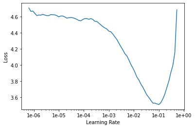
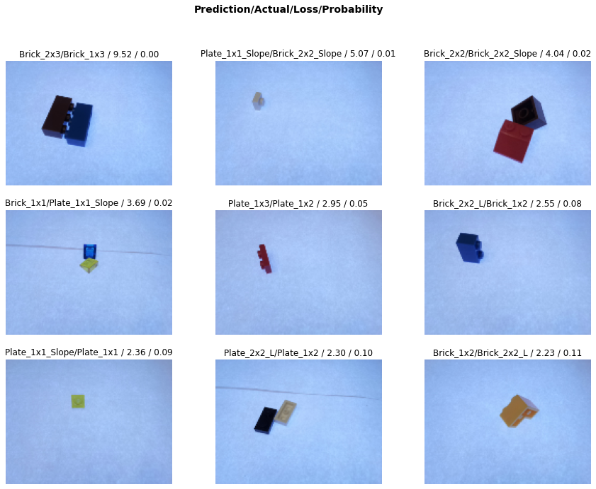

# Identifiing Lego bricks

In this Notebook I will use what I have learned from the [fastai course](https://course.fast.ai/) part one to three. I found this nice lego brick dataset on Kaggle. Thanks to [Francesco Garcia](https://www.kaggle.com/pacogarciam3/lego-brick-sorting-image-recognition), who made lots of pictures of different bricks. CNN classification results of resnet34 and resnet50 are compaired.

### Imports


```python
%reload_ext autoreload
%autoreload 2
%matplotlib inline
%config Completer.use_jedi = False
```


```python
from fastai.vision import *
from fastai.metrics import error_rate
import shutil
from zipfile import ZipFile
from IPython.display import display, Image
```

### Data Import from Kaggle


```python
path = Config.data_path()/'/workspace/course-v3/nbs/dl1/lego/'
path.mkdir(parents=True, exist_ok=True)
path
```
    PosixPath('/workspace/course-v3/nbs/dl1/lego')


```python
kaggle datasets download -d pacogarciam3/lego-brick-sorting-image-recognition
```
</br>
The dataset includes images of size 640 x 480 and an ImageSetKey file.


```python
display(Image(filename='/workspace/course-v3/nbs/dl1/lego/Base Images/Brick_2x2_L/2_Brick_2x2_L_180714193455.jpg'))
```


```python
isk = pd.read_csv('ImageSetKey.csv'); isk
```

<table border="1" class="dataframe">
  <thead>
    <tr style="text-align: right;">
      <th></th>
      <th>Folder1</th>
      <th>Folder2</th>
      <th>Name</th>
      <th>Brick Type</th>
    </tr>
  </thead>
  <tbody>
    <tr>
      <th>0</th>
      <td>Cropped Images</td>
      <td>Brick_1x1</td>
      <td>1_Brick_1x1_180708133346.jpg</td>
      <td>Brick 1x1</td>
    </tr>
    <tr>
      <th>1</th>
      <td>Cropped Images</td>
      <td>Brick_1x1</td>
      <td>1_Brick_1x1_180708133400.jpg</td>
      <td>Brick 1x1</td>
    </tr>
    <tr>
      <th>2</th>
      <td>Cropped Images</td>
      <td>Brick_1x1</td>
      <td>1_Brick_1x1_180708133725.jpg</td>
      <td>Brick 1x1</td>
    </tr>
    <tr>
      <th>3</th>
      <td>Cropped Images</td>
      <td>Brick_1x1</td>
      <td>1_Brick_1x1_180708133739.jpg</td>
      <td>Brick 1x1</td>
    </tr>
    <tr>
      <th>4</th>
      <td>Cropped Images</td>
      <td>Brick_1x1</td>
      <td>1_Brick_1x1_180708133753.jpg</td>
      <td>Brick 1x1</td>
    </tr>
    <tr>
      <th>...</th>
      <td>...</td>
      <td>...</td>
      <td>...</td>
      <td>...</td>
    </tr>
    <tr>
      <th>9155</th>
      <td>Base Images</td>
      <td>Plate_2x4</td>
      <td>2_Plate_2x4_180714163404.jpg</td>
      <td>Plate 2x4</td>
    </tr>
    <tr>
      <th>9156</th>
      <td>Base Images</td>
      <td>Plate_2x4</td>
      <td>2_Plate_2x4_180714163549.jpg</td>
      <td>Plate 2x4</td>
    </tr>
    <tr>
      <th>9157</th>
      <td>Base Images</td>
      <td>Plate_2x4</td>
      <td>2_Plate_2x4_180714163614.jpg</td>
      <td>Plate 2x4</td>
    </tr>
    <tr>
      <th>9158</th>
      <td>Base Images</td>
      <td>Plate_2x4</td>
      <td>2_Plate_2x4_180714163941.jpg</td>
      <td>Plate 2x4</td>
    </tr>
    <tr>
      <th>9159</th>
      <td>Base Images</td>
      <td>Plate_2x4</td>
      <td>2_Plate_2x4_180714163952.jpg</td>
      <td>Plate 2x4</td>
    </tr>
  </tbody>
</table>
<p>9160 rows × 4 columns</p>
</div>


## Looking at the data
As the data are sorted by folder, I do not need the ImageSetKey file, but import them classified by folder name. I downscale the size of the images to be able to do my first training quicker. Vertical transformations are included, as the bricks can be looked at from all directions.

```python
tfms = get_transforms(flip_vert=True)
data = ImageDataBunch.from_folder(path/'Base Images', ds_tfms=tfms, size=(120,160), valid_pct = 0.2)
```

Picture of a databunch.
```python
data.show_batch(rows=3, figsize=(7,6))
```


Checking if the number of classes are correct.
```python
print(data.classes)
len(data.classes),data.c
```

    ['Brick_1x1', 'Brick_1x2', 'Brick_1x3', 'Brick_1x4', 'Brick_2x2', 'Brick_2x2_L', 'Brick_2x2_Slope', 'Brick_2x3', 'Brick_2x4', 'Plate_1x1', 'Plate_1x1_Round', 'Plate_1x1_Slope', 'Plate_1x2', 'Plate_1x2_Grill', 'Plate_1x3', 'Plate_1x4', 'Plate_2x2', 'Plate_2x2_L', 'Plate_2x3', 'Plate_2x4']
    
    (20, 20)


## Training: resnet34

I will give an overview of what I did. To see all the training epochs, have a look into my [Notebook](https://github.com/KonstantinHebenstreit/LegoBricks/blob/master/Fastai%20Lego%20Bricks%20identification.ipynb)

```python
learn = cnn_learner(data, models.resnet34, metrics=error_rate)
```


```python
learn.lr_find()
learn.recorder.plot()
```





After many tryouts, a bigger learning rate seems to work best, followed by a smaller one.


```python
learn.fit_one_cycle(8, slice(7e-2))
```


<table border="1" class="dataframe">
  <thead>
    <tr style="text-align: left;">
      <th>epoch</th>
      <th>train_loss</th>
      <th>valid_loss</th>
      <th>error_rate</th>
      <th>time</th>
    </tr>
  </thead>
  <tbody>
    <tr>
      <td>0</td>
      <td>2.454497</td>
      <td>1.366635</td>
      <td>0.409389</td>
      <td>00:11</td>
    </tr>
    <tr>
      <td>1</td>
      <td>1.933866</td>
      <td>1.390181</td>
      <td>0.382096</td>
      <td>00:11</td>
    </tr>
    <tr>
      <td>2</td>
      <td>1.571198</td>
      <td>0.809790</td>
      <td>0.263100</td>
      <td>00:10</td>
    </tr>
    <tr>
      <td>3</td>
      <td>1.365644</td>
      <td>0.988988</td>
      <td>0.325328</td>
      <td>00:10</td>
    </tr>
    <tr>
      <td>4</td>
      <td>1.004229</td>
      <td>0.681745</td>
      <td>0.191048</td>
      <td>00:10</td>
    </tr>
    <tr>
      <td>5</td>
      <td>0.737355</td>
      <td>0.241512</td>
      <td>0.078603</td>
      <td>00:10</td>
    </tr>
    <tr>
      <td>6</td>
      <td>0.517144</td>
      <td>0.183390</td>
      <td>0.064410</td>
      <td>00:10</td>
    </tr>
    <tr>
      <td>7</td>
      <td>0.412503</td>
      <td>0.182984</td>
      <td>0.064410</td>
      <td>00:11</td>
    </tr>
  </tbody>
</table>


```python
learn.save('stage-1')
```


```python
learn.load('stage-1');
```


```python
learn.lr_find()
learn.recorder.plot()
```


    


### Time to unfreeze and train all layers with a much smaller learning rate

```python
learn.unfreeze()
learn.fit_one_cycle(20, slice(1e-6,1e-4))
```

<table border="1" class="dataframe">
  <thead>
    <tr style="text-align: left;">
      <th>epoch</th>
      <th>train_loss</th>
      <th>valid_loss</th>
      <th>error_rate</th>
      <th>time</th>
    </tr>
  </thead>
  <tbody>
    <tr>
      <td>0</td>
      <td>0.127045</td>
      <td>0.087497</td>
      <td>0.029476</td>
      <td>00:11</td>
    </tr>
    <tr>
      <td>1</td>
      <td>0.125490</td>
      <td>0.088452</td>
      <td>0.029476</td>
      <td>00:11</td>
    </tr>
    <tr>
      <td>2</td>
      <td>0.134781</td>
      <td>0.091879</td>
      <td>0.027293</td>
      <td>00:12</td>
    </tr>
    <tr>
      <td>3</td>
      <td>0.127097</td>
      <td>0.092212</td>
      <td>0.030568</td>
      <td>00:12</td>
    </tr>
    <tr>
      <td>4</td>
      <td>0.134749</td>
      <td>0.095093</td>
      <td>0.027293</td>
      <td>00:11</td>
    </tr>
    <tr>
      <td>5</td>
      <td>0.125789</td>
      <td>0.096245</td>
      <td>0.030568</td>
      <td>00:10</td>
    </tr>
    <tr>
      <td>6</td>
      <td>0.133559</td>
      <td>0.093170</td>
      <td>0.028384</td>
      <td>00:10</td>
    </tr>
    <tr>
      <td>7</td>
      <td>0.120951</td>
      <td>0.092031</td>
      <td>0.029476</td>
      <td>00:10</td>
    </tr>
    <tr>
      <td>8</td>
      <td>0.120843</td>
      <td>0.090243</td>
      <td>0.027293</td>
      <td>00:10</td>
    </tr>
    <tr>
      <td>9</td>
      <td>0.126482</td>
      <td>0.094817</td>
      <td>0.027293</td>
      <td>00:10</td>
    </tr>
  </tbody>
</table>


```python
learn.save('stage-2-2')
```


```python
learn.load('stage-2-2');
```

That looks reasonably good. The train_loss is still higher than the valid_loss, so the model is still underfitting, but an error rate of 2.7% is good enough for now. Let's see if resnet50 will perform better...

## Resnet 50
For this comparisson the same parameters (cycles, learning rates) are used on Resnet 50.

```python
learn = cnn_learner(data, models.resnet50, metrics=error_rate)
```


```python
learn.lr_find()
learn.recorder.plot()
```


```python
learn.fit_one_cycle(8, slice(7e-2))
```


<table border="1" class="dataframe">
  <thead>
    <tr style="text-align: left;">
      <th>epoch</th>
      <th>train_loss</th>
      <th>valid_loss</th>
      <th>error_rate</th>
      <th>time</th>
    </tr>
  </thead>
  <tbody>
    <tr>
      <td>0</td>
      <td>2.092498</td>
      <td>1.881174</td>
      <td>0.437773</td>
      <td>00:12</td>
    </tr>
    <tr>
      <td>1</td>
      <td>1.819227</td>
      <td>1.032634</td>
      <td>0.271834</td>
      <td>00:12</td>
    </tr>
    <tr>
      <td>2</td>
      <td>1.385215</td>
      <td>1.097468</td>
      <td>0.298035</td>
      <td>00:12</td>
    </tr>
    <tr>
      <td>3</td>
      <td>1.115198</td>
      <td>1.561444</td>
      <td>0.336245</td>
      <td>00:12</td>
    </tr>
    <tr>
      <td>4</td>
      <td>0.861129</td>
      <td>0.370810</td>
      <td>0.093886</td>
      <td>00:11</td>
    </tr>
    <tr>
      <td>5</td>
      <td>0.603446</td>
      <td>0.297304</td>
      <td>0.097162</td>
      <td>00:12</td>
    </tr>
    <tr>
      <td>6</td>
      <td>0.407665</td>
      <td>0.150647</td>
      <td>0.051310</td>
      <td>00:12</td>
    </tr>
    <tr>
      <td>7</td>
      <td>0.311949</td>
      <td>0.293816</td>
      <td>0.054585</td>
      <td>00:12</td>
    </tr>
  </tbody>
</table>


```python
learn.save('stage-1-50')
```


```python
learn.load('stage-1-50');
```


```python
learn.lr_find()
learn.recorder.plot()
```

    


```python
learn.unfreeze()
learn.fit_one_cycle(20, slice(1e-6,1e-4))
```


<table border="1" class="dataframe">
  <thead>
    <tr style="text-align: left;">
      <th>epoch</th>
      <th>train_loss</th>
      <th>valid_loss</th>
      <th>error_rate</th>
      <th>time</th>
    </tr>
  </thead>
  <tbody>
    <tr>
      <td>0</td>
      <td>0.105299</td>
      <td>0.097590</td>
      <td>0.030568</td>
      <td>00:16</td>
    </tr>
    <tr>
      <td>1</td>
      <td>0.100494</td>
      <td>0.091623</td>
      <td>0.034934</td>
      <td>00:15</td>
    </tr>
    <tr>
      <td>2</td>
      <td>0.096020</td>
      <td>0.098321</td>
      <td>0.031659</td>
      <td>00:14</td>
    </tr>
    <tr>
      <td>3</td>
      <td>0.092416</td>
      <td>0.104101</td>
      <td>0.032751</td>
      <td>00:14</td>
    </tr>
    <tr>
      <td>4</td>
      <td>0.091387</td>
      <td>0.087126</td>
      <td>0.027293</td>
      <td>00:15</td>
    </tr>
    <tr>
      <td>5</td>
      <td>0.100068</td>
      <td>0.079791</td>
      <td>0.022926</td>
      <td>00:14</td>
    </tr>
    <tr>
      <td>6</td>
      <td>0.096145</td>
      <td>0.077915</td>
      <td>0.022926</td>
      <td>00:15</td>
    </tr>
    <tr>
      <td>7</td>
      <td>0.096186</td>
      <td>0.078397</td>
      <td>0.022926</td>
      <td>00:14</td>
    </tr>
    <tr>
      <td>8</td>
      <td>0.090346</td>
      <td>0.063473</td>
      <td>0.019651</td>
      <td>00:15</td>
    </tr>
    <tr>
      <td>9</td>
      <td>0.087277</td>
      <td>0.071454</td>
      <td>0.028384</td>
      <td>00:15</td>
    </tr>
    <tr>
      <td>10</td>
      <td>0.080934</td>
      <td>0.074586</td>
      <td>0.026201</td>
      <td>00:15</td>
    </tr>
    <tr>
      <td>11</td>
      <td>0.084035</td>
      <td>0.091309</td>
      <td>0.031659</td>
      <td>00:15</td>
    </tr>
    <tr>
      <td>12</td>
      <td>0.080010</td>
      <td>0.080558</td>
      <td>0.026201</td>
      <td>00:15</td>
    </tr>
    <tr>
      <td>13</td>
      <td>0.078485</td>
      <td>0.074554</td>
      <td>0.022926</td>
      <td>00:14</td>
    </tr>
    <tr>
      <td>14</td>
      <td>0.065054</td>
      <td>0.074084</td>
      <td>0.021834</td>
      <td>00:16</td>
    </tr>
    <tr>
      <td>15</td>
      <td>0.061794</td>
      <td>0.070502</td>
      <td>0.021834</td>
      <td>00:17</td>
    </tr>
    <tr>
      <td>16</td>
      <td>0.063228</td>
      <td>0.069556</td>
      <td>0.021834</td>
      <td>00:15</td>
    </tr>
    <tr>
      <td>17</td>
      <td>0.068098</td>
      <td>0.069060</td>
      <td>0.022926</td>
      <td>00:15</td>
    </tr>
    <tr>
      <td>18</td>
      <td>0.067932</td>
      <td>0.067689</td>
      <td>0.022926</td>
      <td>00:14</td>
    </tr>
    <tr>
      <td>19</td>
      <td>0.056359</td>
      <td>0.066412</td>
      <td>0.019651</td>
      <td>00:14</td>
    </tr>
  </tbody>
</table>


```python
learn.save('stage-2-1-50')
```
Note: The model overfitted in the training, we can see that by looking at the error rate. It gets better until epoch 8, and then worse again - which means that it overfits. I leave it here as an example of overfitting. The model 'recovers' and gets back to a good state after 20 epochs.

Wow, the error rate went down to 1.9%, that is almost 30% decrease compared to Resnet34 with 2.7%.

## Results

We will first see which were the categories that the model most confused with one another. We will try if the predictions are reasonable or not (none of the mistakes seems obviously naive). This is an indicator that our classifier is working correctly. 

Furthermore, when we plot the confusion matrix, we can see that the distribution is heavily skewed: the model makes the same mistakes over and over again but it rarely confuses other categories. This suggests that it just finds it difficult to distinguish some specific categories between each other.


```python
interp = ClassificationInterpretation.from_learner(learn)

losses,idxs = interp.top_losses()

len(data.valid_ds)==len(losses)==len(idxs)
```

    True


```python
interp.plot_top_losses(9, figsize=(15,11))
```





As we can see, the neural net has difficulties if pictures contain more than one object. The first picture in the top left seems very reasonable, as the nn classifies the 1x3 brick as one 2x3 brick. The second picture is wrong classified by the nn, but also mislabelled as in the dataset. So the nn classified a 1x1 brick as 1x1 slope brick.


Let' see all confused ones in a confusion matrix:

```python
interp.plot_confusion_matrix(figsize=(12,12), dpi=60)
```


The neural net confuses only two bricks with each other more than once (Plate_1x1 with Plate_1x1_Slope and Plate_1x2 with Plate_2x2_L). They both seem reasonable misinterpretations since the look alike very much from a certain angle.  

## Possible Improvements
 - The imagesize was reduced all the time. For better results, it would be useful to train the nn in multiple steps. Starting at small pictures and going step by step to bigger ones maximizes accuracy. 

 - Picking a smaller learning rate at the first cycle could reduce the interim increse in loss after a few epochs.
